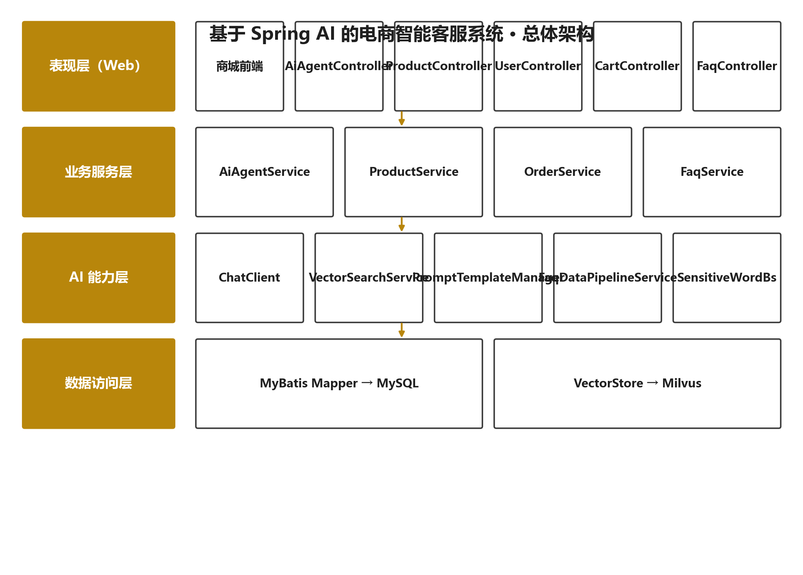
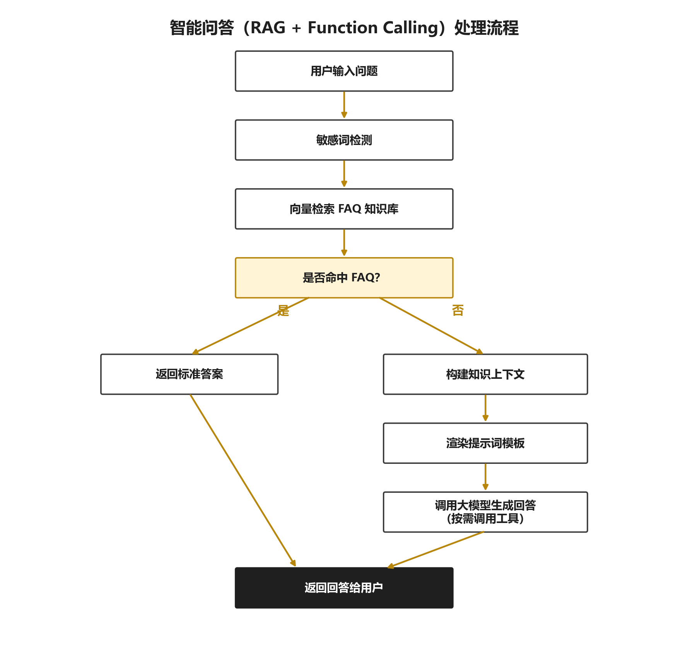

# 艾瑞电商 AI 客服助手 · E-commerce AI Customer Service Agent

[](https://github.com/kouoe/910/actions/workflows/ci.yml)
[](LICENSE)
[](https://github.com/kouoe/910/tags)
[](https://www.oracle.com/java/)
[](https://spring.io/projects/spring-boot)
[](https://milvus.io/)
[](CONTRIBUTING.md)

基于 **Spring AI + Milvus** 的电商智能客服系统。核心是一条「三级问答流水线」：**敏感词检测 → Milvus 向量语义检索（RAG）→ LLM 生成回答**，并支持 Function Calling 实时查询订单与商品。仓库同时提供一套用于**自动生成配套实习报告（docx）**的 Python 工具。



---

## ✨ 项目亮点

> 不只是"调个大模型"，而是围绕**可信、可控、可用**做了完整工程化设计。

- 🧠 **防幻觉约束** — 系统提示词强制规定：知识库无命中时必须如实回答"没有查到，建议联系人工客服"，严禁编造商品、价格、库存与活动信息。这是客服问答能否商用的关键
- 🔄 **双库一致性** — MySQL 作为 FAQ 主数据源、Milvus 作为向量副本，支持单条增量同步与 `GET /syncToMilvus` 全量重建，数据不会漂移
- 🛡️ **内容安全** — 敏感词黑白名单存于 MySQL，支持运行时热更新，无需重启服务
- 🔍 **全链路可观测** — `TraceIdFilter` 为每次请求生成 traceId 注入 MDC，日志从入口到模型调用全程可追踪
- 🔌 **工具增强生成** — Function Calling 让 AI 自主调用订单 / 商品查询，回答基于真实数据而非模型记忆
- 🔐 **安全默认值** — 密钥零硬编码全走环境变量；关闭 Druid 监控页规避历史 CVE；`.gitignore` 屏蔽 Docker 数据卷，防止运行时数据误提交
- 📦 **开箱即用** — Docker 一键拉起 Milvus 全家桶，SQL 脚本一键初始化 6 张表与演示数据，内置对话页无需另搭前端

---

## 🚀 核心能力

| 能力 | 说明 |
| :--- | :--- |
| 三级问答流水线 | 敏感词拦截 → 向量召回 → LLM 生成，层层把关 |
| RAG 知识库问答 | `IVF_FLAT` + `COSINE` 检索，回答严格基于 FAQ 知识库 |
| Function Calling | 订单查询（单号/状态）、商品搜索、价格区间、热销排行 |
| 多轮对话记忆 | 基于 Spring AI ChatMemory，支持上下文追问 |
| 敏感词治理 | 黑白名单 + 运行时热更新 |
| 链路追踪 | traceId 贯穿请求与日志 |
| 统一响应体系 | `R` 返回体 + `ErrorCode` + `GlobalExceptionHandler` |
| 业务闭环 | 用户注册登录、商品浏览、购物车增删改查 |

## 🔄 智能问答处理流程



---

## 🛠️ 技术栈

| 层次 | 技术 |
| :--- | :--- |
| 语言 / 框架 | Java 17 · Spring Boot 3.5.6 · Spring MVC |
| AI 能力 | Spring AI 1.0.0 · Spring AI Alibaba（DashScope：`qwen-plus` 对话 / `text-embedding-v2` 向量） |
| 向量数据库 | Milvus v3.0.1（Docker Standalone：etcd + MinIO） |
| 业务存储 | MySQL 8 · MyBatis · Druid 连接池 |
| 内容安全 | sensitive-word 0.21.0 |
| 构建 / CI | Maven · GitHub Actions · Dependabot |
| 容器化 | Docker（多阶段构建） |
| 报告工具 | Python 3（matplotlib + Pillow） |

---

## 📁 目录结构

```
910/
├── backend/                      # 后端主工程（Spring Boot）
│   ├── Dockerfile                # 多阶段构建镜像
│   ├── pom.xml
│   ├── sql/init.sql              # 建库建表 + 演示数据
│   └── src/main/java/com/airi/ai/agent/
│       ├── controller/           # HTTP 接口
│       ├── service/              # 三级问答编排核心
│       ├── search/               # 向量检索策略
│       ├── data/                 # MySQL → Milvus 数据管道
│       ├── functioncall/         # 供大模型调用的工具
│       ├── prompt/               # 提示词模板管理
│       ├── mapper/ pojo/ result/ exception/ config/
│       └── resources/static/     # 内置对话页与 FAQ 管理页面
├── docker/                       # 基础设施编排
│   ├── docker-compose.yml        # Milvus + etcd + MinIO
│   └── embedEtcd.yaml
├── docs/                         # 设计文档
│   ├── images/                   # 架构图 / 流程图 / E-R 图
│   ├── ARCHITECTURE.md
│   ├── API.md
│   └── DATABASE.md
├── tools/report-generator/       # 实习报告生成工具（Python）
├── .github/                      # CI、Issue 与 PR 模板、依赖机器人
├── CHANGELOG.md  CONTRIBUTING.md  SECURITY.md  CODE_OF_CONDUCT.md
├── LICENSE
└── README.md
```

---

## 🚀 快速开始

### 前置要求

| 依赖 | 版本 | 用途 |
| :--- | :--- | :--- |
| JDK | 17+ | 运行后端 |
| Maven | 3.6+ | 构建 |
| Docker | 任意 | 运行 Milvus |
| MySQL | 8+ | 业务数据 |
| DashScope API Key | — | [阿里云百炼](https://bailian.console.aliyun.com/) 申请 |

### 1. 启动向量数据库（Milvus）

```bash
cd docker
docker compose up -d
docker ps          # 应看到 milvus-standalone / milvus-etcd / milvus-minio
```

Milvus 端口 `19530`，健康检查端口 `9091`，MinIO 控制台 `http://localhost:9001`。
数据卷写在 `docker/volumes/`，已被 `.gitignore` 忽略。

### 2. 初始化业务数据库

```bash
mysql -u root -p < backend/sql/init.sql
```

创建 `ai-agent` 库及 6 张表，并灌入 FAQ、订单、商品、敏感词演示数据。

### 3. 配置环境变量

密钥**不写入代码**，通过环境变量注入。

Windows（PowerShell，配置后需重启终端 / IDEA）：

```powershell
setx DASHSCOPE_API_KEY "你的百炼APIKey"
setx DB_USERNAME "root"
setx DB_PASSWORD "你的MySQL密码"
```

macOS / Linux：

```bash
export DASHSCOPE_API_KEY="你的百炼APIKey"
export DB_USERNAME="root"
export DB_PASSWORD="你的MySQL密码"
```

### 4. 启动后端

方式一：Maven 直接运行（开发推荐）

```bash
cd backend
mvn spring-boot:run
```

方式二：Docker 容器运行（部署推荐）

```bash
docker build -t airi-agent ./backend
docker run -d --name airi-agent -p 8080:8080 \
  -e DASHSCOPE_API_KEY=$DASHSCOPE_API_KEY \
  -e DB_USERNAME=root \
  -e DB_PASSWORD=$DB_PASSWORD \
  airi-agent
```

看到 `Started SpringAiSxApplication` 即启动成功，服务监听 `http://localhost:8080`。

### 5. 验证

打开内置对话页 **http://localhost:8080/** ，或直接调用接口：

```bash
curl -X POST http://localhost:8080/ai/agent/chat \
  -H "Content-Type: application/json" \
  -d '{"message": "如何查看我的订单物流信息？"}'
```

```json
{"code":0,"msg":"成功","dataMap":{"response":"您可以在\"我的订单\"中找到对应订单，点击\"查看物流\"即可实时跟踪包裹位置。"}}
```

---

## 📖 文档索引

| 文档 | 内容 |
| :--- | :--- |
| [ARCHITECTURE.md](docs/ARCHITECTURE.md) | 分层设计、三级流水线、RAG 同步机制、非功能性设计、选型理由 |
| [API.md](docs/API.md) | 全部接口清单、请求参数与 curl 示例 |
| [DATABASE.md](docs/DATABASE.md) | 表结构设计、字段说明与初始化方式 |
| [tools/report-generator/README.md](tools/report-generator/README.md) | 实习报告自动生成工具用法 |
| [CONTRIBUTING.md](CONTRIBUTING.md) | 贡献流程、分支与 Commit 规范 |
| [SECURITY.md](SECURITY.md) | 漏洞报告渠道与凭据管理约定 |
| [CHANGELOG.md](CHANGELOG.md) | 版本变更记录 |

---

## 🧪 测试

```bash
cd backend
mvn test
```

> 部分测试用例依赖本地 MySQL / Milvus 实例，CI 中该项配置为 `continue-on-error`，不会阻断构建。

## 📄 实习报告生成

```bash
cd tools/report-generator
pip install -r requirements.txt
python gen_images.py     # 生成五张配图
python gen_report3.py    # 生成完整 Word 报告
python verify.py         # 校验文档合法性
```

详见 [tools/report-generator/README.md](tools/report-generator/README.md)。

---

## 🗺️ Roadmap

- [ ] 问答接口支持 SSE 流式输出，降低首字延迟
- [ ] 引入 Redis 缓存热点 FAQ，减少重复向量检索开销
- [ ] 知识库支持文档上传（PDF / Word）自动切片入库
- [ ] 接入多轮对话评测集，量化回答准确率与幻觉率
- [ ] Admin 管理后台：FAQ 可视化维护与检索效果调试
- [ ] 全链路接入 OpenTelemetry，替代自研 TraceId 方案

---

## 🤝 参与贡献

欢迎提交 Issue 与 PR！开始前请先阅读 [CONTRIBUTING.md](CONTRIBUTING.md)，了解分支命名、**英文 Commit Message（Conventional Commits）**规范与代码风格要求。

安全相关问题请参考 [SECURITY.md](SECURITY.md)，请勿公开提交。

## 📜 许可证

本项目基于 [MIT License](LICENSE) 开源。使用即代表你已阅读并同意 [行为准则](CODE_OF_CONDUCT.md)。
