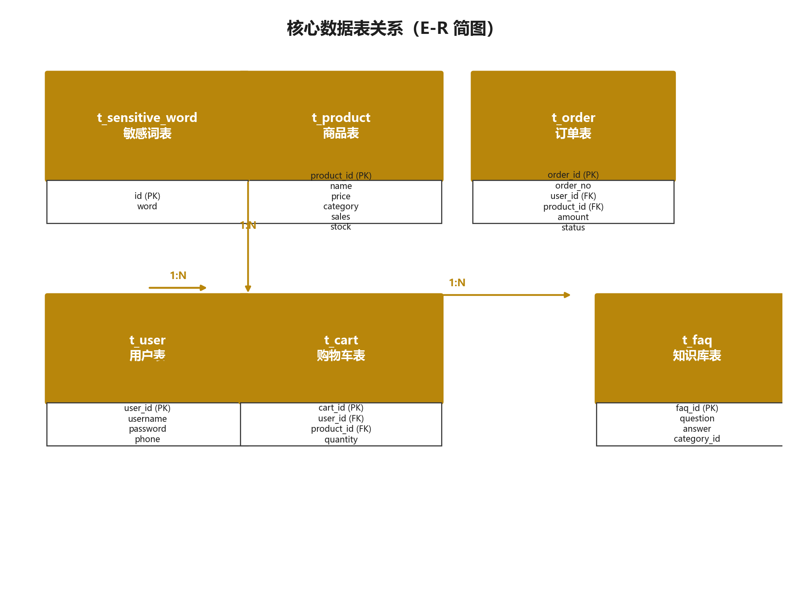

# 数据库设计

> [← 返回 README](../README.md)

初始化脚本：[`backend/sql/init.sql`](../backend/sql/init.sql)（建库 + 建表 + 灌入演示数据，**首次部署执行一次即可**）。

> ⚠️ 脚本使用 `DROP TABLE IF EXISTS`，会重建表并重置数据，请勿在生产库上执行。

## 实体关系



数据库名：`ai-agent`（utf8mb4）。MySQL 存放业务主数据，Milvus `common_response` 集合存放 FAQ 的向量副本，两者通过 FAQ ID 关联。

## 表清单

| 表名 | 用途 | 初始数据 |
| :--- | :--- | :--- |
| `t_faq` | FAQ 知识库（向量检索的主数据源） | 8 条 |
| `t_order` | 订单，供 Function Calling 查询 | 6 条 |
| `t_product` | 商品，供商品搜索 / 价格查询 / 热销排行 | 12 条 |
| `t_user` | 用户账号 | 空（运行时注册） |
| `t_cart` | 购物车条目 | 空 |
| `t_sensitive_word` | 敏感词黑白名单 | 4 条 |

## 建表与运行

```bash
mysql -u root -p < backend/sql/init.sql
```

或在 MySQL 客户端中直接执行脚本内容。应用侧连接配置见 `backend/src/main/resources/application.yml`，账号密码通过环境变量 `DB_USERNAME` / `DB_PASSWORD` 注入。

---

## `t_faq` — FAQ 知识库

| 字段 | 类型 | 说明 |
| :--- | :--- | :--- |
| `id` | VARCHAR(64) PK | FAQ ID（UUID 去横线） |
| `category_id` | INT | 分类：1-订单 / 2-支付 / 3-商品 / 4-账户 / 5-其他 |
| `question` | VARCHAR(500) | 常见问题 |
| `answer` | TEXT | 标准答案 |
| `status` | TINYINT | 状态：0-禁用 / 1-启用 |
| `use_count` | INT | 命中次数 |

索引：`idx_category`、`idx_status`。

## `t_order` — 订单

| 字段 | 类型 | 说明 |
| :--- | :--- | :--- |
| `id` | BIGINT PK | 主键（自增） |
| `order_no` | VARCHAR(32) UNIQUE | 订单编号 |
| `product_name` | VARCHAR(100) | 商品名称 |
| `amount` | DECIMAL(10,2) | 订单金额（元） |
| `status` | VARCHAR(20) | 待支付 / 待发货 / 配送中 / 已签收 / 已退货 |
| `create_time` | DATETIME | 下单时间 |

## `t_product` — 商品

| 字段 | 类型 | 说明 |
| :--- | :--- | :--- |
| `id` | BIGINT PK | 主键（自增） |
| `product_no` | VARCHAR(32) UNIQUE | 商品编号 |
| `name` | VARCHAR(100) | 商品名称 |
| `category` | VARCHAR(50) | 分类（手机数码 / 电脑办公 / 智能穿戴 / 智能家居 / 网络设备） |
| `price` | DECIMAL(10,2) | 价格（元） |
| `stock` | INT | 库存数量 |
| `sales` | INT | 累计销量（热销排行依据） |
| `status` | TINYINT | 0-下架 / 1-在售 |
| `create_time` | DATETIME | 上架时间 |

## `t_user` — 用户

| 字段 | 类型 | 说明 |
| :--- | :--- | :--- |
| `id` | BIGINT PK | 主键（自增） |
| `username` | VARCHAR(50) UNIQUE | 登录账号 |
| `password` | VARCHAR(128) | 密码（SHA-256 加盐哈希） |
| `nickname` | VARCHAR(50) | 昵称 |
| `phone` | VARCHAR(20) | 手机号 |
| `create_time` | DATETIME | 注册时间 |

## `t_cart` — 购物车

| 字段 | 类型 | 说明 |
| :--- | :--- | :--- |
| `id` | BIGINT PK | 主键（自增） |
| `user_id` | BIGINT | 用户 ID |
| `product_no` | VARCHAR(32) | 商品编号 |
| `quantity` | INT | 数量（默认 1） |
| `create_time` | DATETIME | 加入时间 |

唯一键 `uk_user_product (user_id, product_no)`，保证同一商品在购物车中只有一条记录。

## `t_sensitive_word` — 敏感词黑白名单

| 字段 | 类型 | 说明 |
| :--- | :--- | :--- |
| `id` | BIGINT PK | 主键（自增） |
| `word` | VARCHAR(255) | 敏感词内容 |
| `type` | VARCHAR(10) | `deny` 黑名单 / `allow` 白名单 |

初始数据：黑名单「假货」「刷单」，白名单「正品」「退货」。支持通过接口热更新，无需重启服务。
